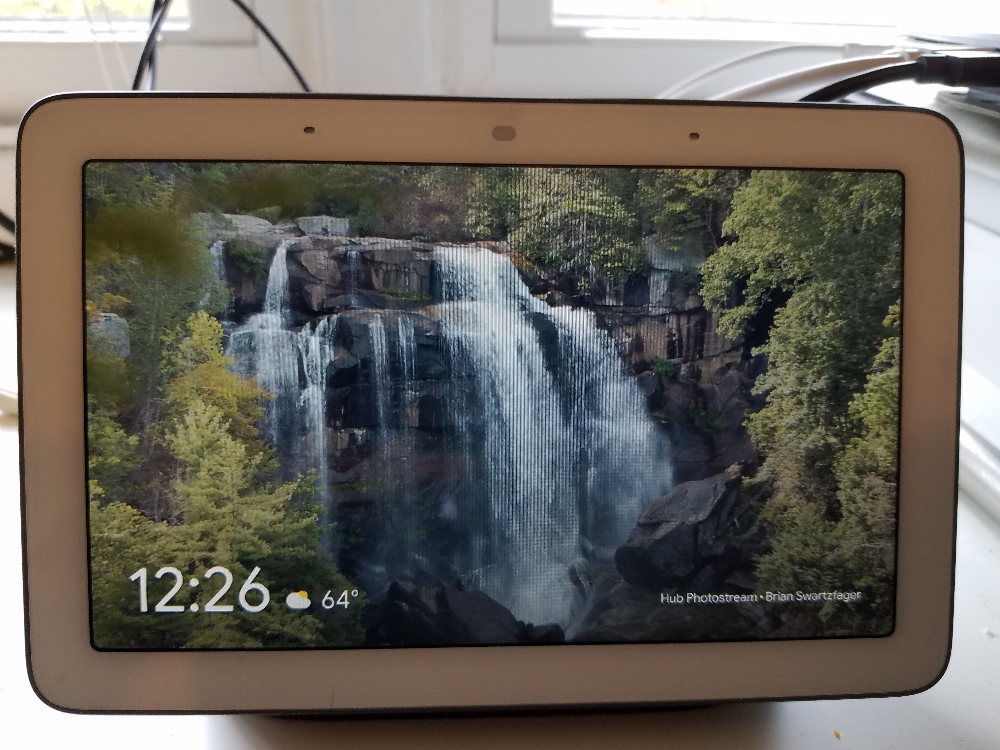
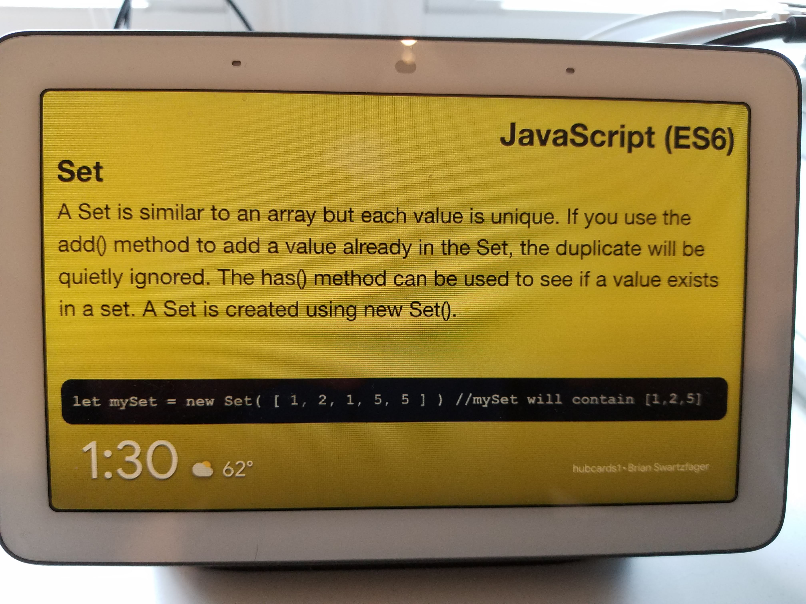
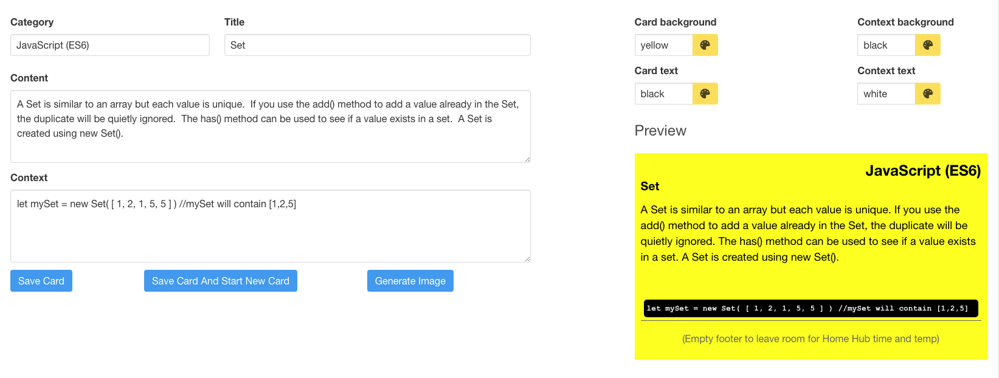

# Hubcards

## TL;DR

Hubcards is a Vue.js / Firebase Cloud Firestore app for generating flashcard-style images that fit 
a Google Home Hub screen.  Skip to the "Installation and Setup" section to learn how to install and run it.

## Background

I own a Google Home Hub, which sits under and between my dual monitors in my home office.  I use
it to play music while I'm working, but I move the music player to the background to take 
advantage of the Hub's "Ambient Mode".  In Ambient Mode, the Hub will cycle through a collection of
images, either generic landscape/themed images that Google provides or images from one or more
of your photo albums on Google photos (I opt for the latter).  You can have the time and weather appear over the bottom
left of the images.

</img>

One day it occurred to me to wonder if I could get Ambient Mode to cycle through a series of 
flashcards that would help me learn programming concepts or syntax through repetition.  

</img>

The main obstacle with that idea was that Ambient Mode is strictly limited to displaying photos (you can't
point it to a series of Google Doc entries, for example), and using a graphics or presentation
program to create the images with the correct dimensions was time-consuming.

Hubcards was created to overcome that obstacle.  The content for the cards is stored online in 
Cloud Firestore and is managed through a Vue.js-powered web application that lets you preview the
card image and choose the color scheme.  When you are ready to generate a card, it converts the 
browser's DOM display of the card into an image using the [html-to-image](https://www.npmjs.com/package/html-to-image) NPM module and then outputs the image to the downloads folder of your browser using the [downloadjs](https://www.npmjs.com/package/downloadjs) NPM module, and from there you can upload the images to the Google Photos album of your choice.  The web application ensures that the generated image is sized in a way that fits the Hub screen.

</img>

Hubcards runs on the following technologies:

* The [Vue.js JavaScript](https://vuejs.org/) framework using:

    * Vue CLI 3.2
    
    * Vue Router 3.0.1
    
    * Vuex data store 3.0.1
    
* [Firebase](https://firebase.google.com/) authentication and the Firebase [Cloud Firestore](https://firebase.google.com/products/firestore/) 
  document datastore

* The [Bulma](https://bulma.io/) CSS framework.

* The [html-to-image](https://www.npmjs.com/package/html-to-image) NPM module.

* The [downloadjs](https://www.npmjs.com/package/downloadjs) NPM module.


## Installation and Setup

* Install the latest version of Vue CLI

* Checkout or download the code, then run "npm install" to install the needed packages.

* Create a Firebase Cloud Firestore project and add the configuration settings to the codebase:

    * Go to the Firebase website. Sign in using your Google credentials.
    
    * In the menu bar, click "Go to Console". Click on "Add Project". Give the project a name and click the "Continue" button. 
      Select any data sharing options you want and click "Create Project". When the project is ready, click "Continue"
    
    * The next screen will invite you to add Firebase to your app and display icons for iOS, Android, and the web. Click on the web icon.
  
    * A modal window will appear containing a code snippet. All you need from the snippet is the "config" object variable.
    
    * In the "src" directory of the codebase, create a file named "firebaseSettings.js". 
      Copy the "config" object into that file and end the file with the line "export default config".  Example:
      
      ```javascript
        var config = {
          apiKey: "YOUR_API_KEY",
          authDomain: "PROJECT_NAME.firebaseapp.com",
          databaseURL: "https://PROJECT_NAME.firebaseio.com",
          projectId: "PROJECT_NAME",
          storageBucket: "",
          messagingSenderId: "SOME_NUMBER"
        };
        
        export default config;
        ```
    * Return to the Firebase console view of your new Firebase project. In the left column, click on "Authentication". 
      In the Authentication panel, click on the "Sign-in method" menu item, then click on the "Email/Password" option 
      and enable it. This enables the authentication method used in this Vue application. Click "Save".
     
    * In the left column of the console window, select "Database". You will be prompted to create a Cloud Firestore database. 
      Click the "Create database" button.
      
    * A modal window will appear to let you choose the security rules for your database.  Change the
      default rule to the following to restrict certain actions to authenticated users, then click the "Enable" button:
      
      ```javascript
          service cloud.firestore {
            match /databases/{database}/documents {
              match /cards/{card} {
                allow read, write: if request.auth.uid != null;
              }
              match /users/{user} {
                allow read;
                allow write: if request.auth.uid != null;
              }
               match /{document=**} {
                allow read, write;
              }
            }
          }
       ```
      
    * The Firebase side of the application is now ready to go: you can either close the Firebase console, or leave it 
      open to observe the changes made as you use the application.
      
* Run the application using "npm run serve".

* Click the "Create App User" in the navigation bar to create the first user account / document.

## Features / Notes

* Each card belongs to a category, so you can organize your cards by topic and filter your list view of the cards
  by category.
  
* You can configure how the filenames of the generated images are constructed:  incorporating a date or timestamp
  in the filename can help you distinguish older versions of the same card from each other.
  
* The app remembers the colors you use in your cards so that when you generated new cards you can reuse old color
  schemes using a basic color picker mechanism.
  
* Most of the code concerned with authentication, user account creation, and navigation was borrowed from my 
  [Firebase Cloud Firestore Vue Users application](https://github.com/bcswartz/fcf-vue-users).
  
* Hubcards is a minimum viable product (MVP):  it answers the basic challenge of generating the desired images but 
  there is plenty of room for improvement.  Some of those potential improvements include:
    
    * Better filtering / searching of existing cards to help manage large card collections.
    
    * Bulk image generation.
    
    * Support for code formatting (visually-pleasing code examples) within the card.
